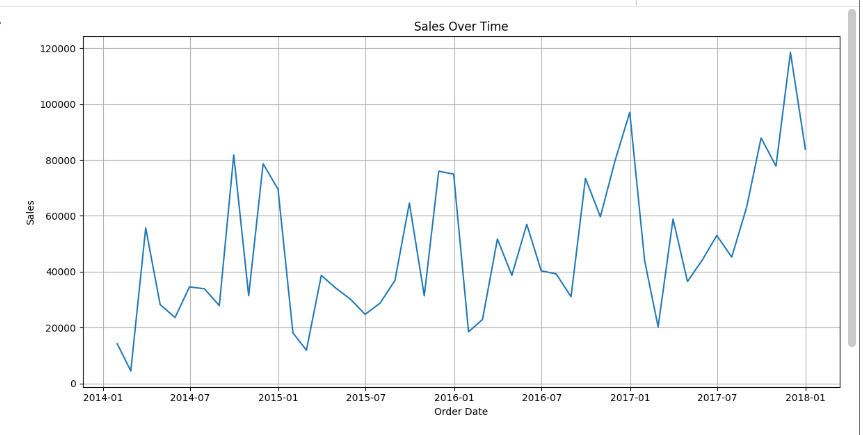
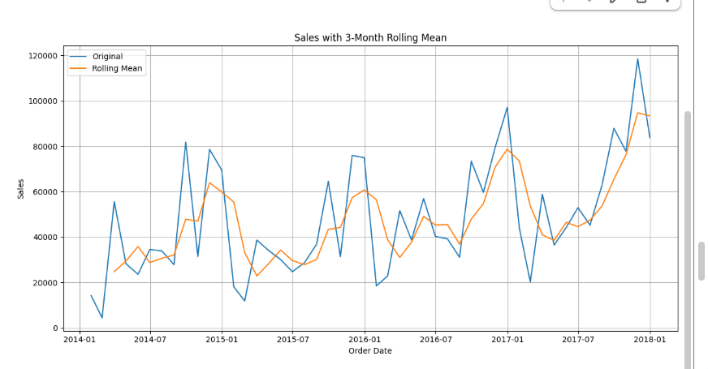
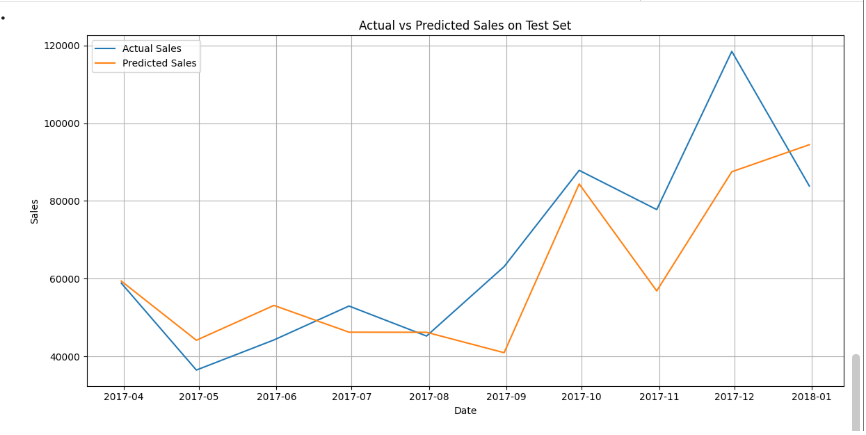
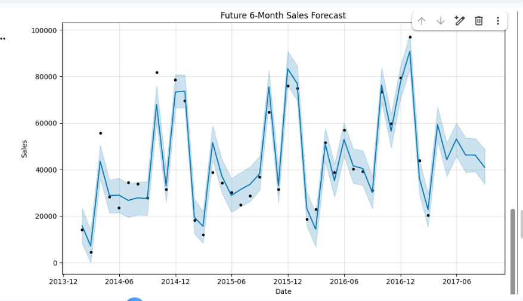

# 📈 Sales Forecasting Using Prophet (Time Series Analysis)

## 🧠 Project Overview
This project predicts future sales using historical retail data. 
A time-series forecasting model is built using Facebook Prophet to capture:

- Trend
- Seasonality
- Long-term growth patterns

The model is trained on aggregated monthly sales data and evaluated using MAE and RMSE.

---

## 🎯 Business Objective
Accurate sales forecasting helps businesses:

- Plan inventory efficiently
- Reduce stock-outs and overstocking
- Optimize promotions
- Improve revenue forecasting
- Support data-driven decision-making

---

## 📊 Dataset
Dataset: Sample Superstore Sales Data

Key Columns Used:
- Order Date
- Sales

The data is:
- Cleaned
- Converted to datetime format
- Aggregated monthly
- Split into training and testing sets (80/20 split)

---

## ⚙️ Methodology

### 1️⃣ Data Preprocessing
- Converted Order Date to datetime
- Sorted by date
- Aggregated monthly sales
- Removed missing values

### 2️⃣ Exploratory Analysis
- Time-series sales visualization
- 3-Month Rolling Mean for trend inspection

### 3️⃣ Model Used
### 📌 Prophet
Prophet is a decomposable time-series model that captures:
- Trend
- Yearly seasonality
- Future forecasting components

---

## 📊 Model Evaluation

Model performance evaluated using:

- *MAE (Mean Absolute Error)*
- *RMSE (Root Mean Squared Error)*

The model predicts sales for the test dataset and compares actual vs predicted values.

---

## 📈 Forecasting

- Test set forecasting
- Future 6-month sales prediction
- Trend component visualization
- Yearly seasonality component visualization

---

## 📊 Sample Visualizations

### Sales Over Time

### Rolling Mean Trend

### Actual vs Predicted

### Future 6-Month Forecast

---

## 🚀 How to Run

1. Clone repository:

git clone <your-repo-link>

2. Install dependencies:

pip install -r requirements.txt

3. Run:

Sales_Forecasting.ipynb

---

## 📌 Key Insights

- Sales show clear seasonal patterns.
- Prophet successfully captures trend and seasonality.
- Forecasting helps estimate future demand.

---
